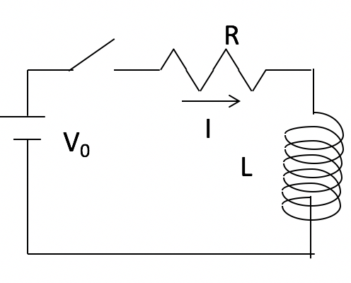
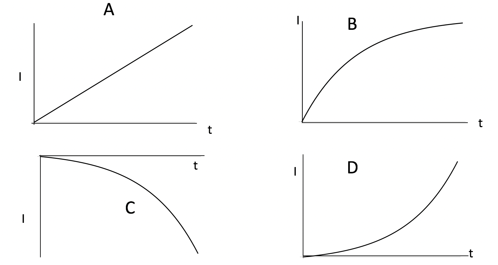

<section data-markdown>

Loop 1 sits in a uniform field B which is increasing in magnitude. Loop 2 has the SAME LENGTH OF WIRE looped (coiled) to make two (smaller) loops.
How do the induced EMFs compare?

1. EMF(1)=4 EMF(2)
2. EMF(1) = 2 EMF(2)
3. They are both the same.
4. EMF(2)= 4 EMF(1)
5. EMF(2) = 2 EMF(1)

Note:
* Correct Answer: B
* Reduce A by 4, Loops up by 2
</section>

<section data-markdown>

The switch is closed at $t=0$. What can you say about $I(t=0+)$?

1. Zero
2. $V_0/R$
3. $V_0/L$
4. Something else!
5. ???

Note:
* Correct Answer: B

</section>

<section data-markdown>

The switch is closed at $t=0$.
Which graph best shows $I(t)$?

E) None of these (they all have a serious error!)

Note:
* Correct Answer: B

</section>

<section data-markdown>

The switch is closed at $t=0$.
What can you say about the magnitude of $\Delta V$(across the inductor) at
$(t=0+)$?

1. Zero
2. $V_0$
3. $L$
4. Something else!
5. ???

Note:
* Correct Answer: B

</section>

<section data-markdown>

The complex exponential: $e^{i\omega t}$ is useful in calculating properties of many time-dependent equations. According to Euler, we can also write this function as:

1. $\cos(i \omega t) + \sin (i \omega t)$
2. $\sin (\omega t) + i \cos(\omega t)$
3. $\cos(\omega t) + i \sin (\omega t)$
4. MORE than one of these is correct
5. None of these is correct!

Note:
* Correct Answer: C
</section>

<section data-markdown>

What is $\vert 2+i \vert$?

1. $1$
2. $\sqrt{3}$
3. $5$
4. $\sqrt{5}$
5. Something else!

Note:
* Correct Answer: D
</section>
