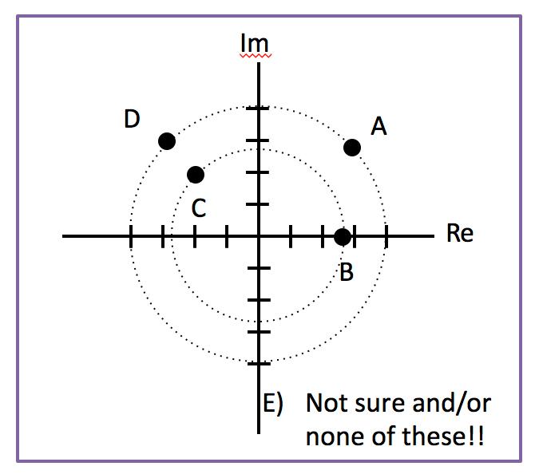

<section data-markdown>

The complex exponential: $e^{i\omega t}$ is useful in calculating properties of many time-dependent equations. According to Euler, we can also write this function as:

1. $\cos(i \omega t) + \sin (i \omega t)$
2. $\sin (\omega t) + i \cos(\omega t)$
3. $\cos(\omega t) + i \sin (\omega t)$
4. MORE than one of these is correct
5. None of these is correct!

Note:
* Correct Answer: C
* Just a reminder of the euler equation for the future
</section>

<section data-markdown>

## Announcements
* Quiz 3 (next Friday 2/22) - RLC circuits
  * Solve a circuit problem using the phasor method
  * Discuss limits on the response and how it might act as a filter

</section>

<section data-markdown>

What is $\vert 2+i \vert$?

1. $1$
2. $\sqrt{3}$
3. $5$
4. $\sqrt{5}$
5. Something else!

Note:
* Correct Answer: D
* Use pythagoras in the complex plane
</section>

<section data-markdown>

What is $(1+i)^2/(1-i)$?

1. $e^{i\pi/4}$
2. $\sqrt{2}e^{i\pi/4}$
3. $e^{i3\pi/4}$
4. $\sqrt{2}e^{i3\pi/4}$
5. Something else!

Note:
* Correct Answer: D
* Best to convert to euler with phase and just use the rules for adding and subtracting of exponents

</section>

<section data-markdown>

Which point below best represents $4e^{i3\pi/4}$ on the complex plane?

Note:
* Correct Answer: D

</section>

<section data-markdown>

What is $Re\left[\frac{e^{i\omega t}}{1+i}\right]$?

1. $\frac{1}{\sqrt{2}}\cos(\omega t + \pi/4)$
2. $\frac{1}{\sqrt{2}}\cos(\omega t - \pi/4)$
3. $\frac{1}{{2}}\cos(\omega t + \pi/4)$
4. $\frac{1}{{2}}\cos(\omega t - \pi/4)$
5. Something else

Note:
* Correct Answer: B

</section>
