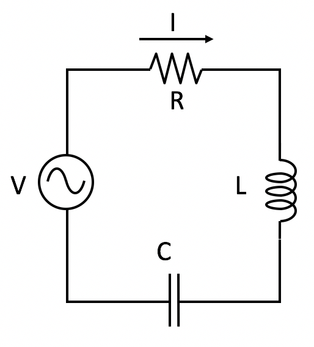
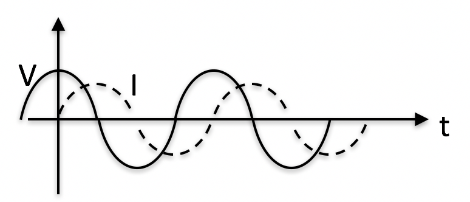

<section data-markdown>

A resistor ($R$) and an inductor ($L$) are in parallel. What is the effective impedance, $Z_{eff}$ across these elements?

1. $R + L$
2. $R + i\omega L$
3. $1/(R+i\omega L)$
4. $\dfrac{1}{1/R -i/(\omega L)}$
5. Something else?

Note:
* Correct Answer: D

</section>

<section data-markdown>

What is the total impedance of this circuit, $Z_{total}$?

1. $R + i\left(\omega L + \frac{1}{\omega C}\right)$
2. $R + i\left(\omega L - \frac{1}{\omega C}\right)$
3. $\frac{1}{R} + \frac{1}{i\omega L} + {i \omega C}$
4.  $\dfrac{1}{\frac{1}{R} + \frac{1}{i\omega L} + {i \omega C}}$
5. None of these

Note:
* Correct Answer: B

</section>

<section data-markdown>

AC voltage $V$ and current $I$ vs time $t$ are as shown:

The graph shows that..

1. $I$ leads $V$  ( $I$ peaks before $V$ peaks )
2. $I$ lags $V$    ( $I$ peaks after $V$ peaks )
3. Neither

Note:
* Correct Answer: B

</section>

<section data-markdown>
Suppose you have a circuit driven by a voltage:
$$V(t)=V_0\cos(\omega t)$$

You observe the resulting current is:
$$I(t) = I_0\cos(\omega t-\pi/4)$$

Would you say the current is

1. leading
2. lagging

the voltage by 45 degrees?

Note:
* Correct Answer: B
</section>

<section data-markdown>

Consider an RC circuit attached to a sinusoidally driven voltage source. If at $t=0$ we turn on the source, $I(t=0)=\frac{V_0}{R}$. Then the current follows this solution,

$$I(t) = \dfrac{V_0}{\sqrt{R^2+\frac{1}{\omega^2C^2}}}\cos(\omega t + \phi) - \left(\dfrac{V_0}{R}-\dfrac{V_0\cos\phi}{\sqrt{R^2+\frac{1}{\omega^2C^2}}}\right)e^{-t/RC}$$

What happens to the long term current as $\omega \rightarrow 0$?

1. goes to zero
2. goes to $\dfrac{V_0}{R}$
3. goes to infinity
4. Something else

Note:
* Correct answer: A

</section>

<section data-markdown>

Consider an RC circuit attached to a sinusoidally driven voltage source. If at $t=0$ we turn on the source, $I(t=0)=\frac{V_0}{R}$. Then the current follows this solution,

$$I(t) = \dfrac{V_0}{\sqrt{R^2+\frac{1}{\omega^2C^2}}}\cos(\omega t + \phi) - \left(\dfrac{V_0}{R}-\dfrac{V_0\cos\phi}{\sqrt{R^2+\frac{1}{\omega^2C^2}}}\right)e^{-t/RC}$$

What happens to the long term current as $\omega \rightarrow \infty$?

1. goes to zero
2. goes to $\dfrac{V_0}{R}$
3. goes to infinity
4. Something else

Note:
* Correct answer: B

</section>
