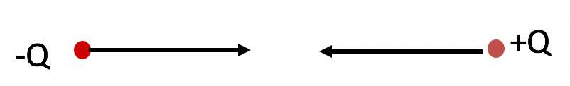

<section data-markdown>

The work energy theorem states:

$$W = \int_i^f \mathbf{F}net\cdot d\mathbf{l} = \frac{1}{2}mv_f^2 - \frac{1}{2} mv_i^2$$

This theorem is valid:

1. only for conservative forces.
2. only for non-conservative forces.
3. only for forces which are constant in time
4. only for forces which can be expressed as potential energies
5. for all forces.

Note:
* Correct Answer: E

</section>

<section data-markdown>

A + and - charge are held a distance R apart and released.
The two particles accelerate toward each other as a result of the Coulomb attraction.  As the particles approach each other, the energy contained in the electric field surrounding the two charges...

1. increases
2. decreases
3. stays the same

Note:
* Correct Answer: B

</section>

<section data-markdown>

The time rate of change of the energy density is,

$\frac{\partial}{\partial t} u
_q = -\frac{\partial}{\partial t}(\frac{\varepsilon_0}{2}E^2 + \frac{1}{2\mu_0}B^2)-\nabla \cdot \mathbf{S}$

where $\mathbf{S} = \frac{1}{\mu_0}\mathbf{E} \times \mathbf{B}$.

How do you interpret this equation? In particular: Does the minus sign on the first term on the right seem ok?

1. Yup
2. It's disconcerting, did we make a mistake?
3. ??

Note:
* Correct Answer: A
* Talk about the signs with them
</section>

<section data-markdown>

If we integrate the energy densities over a closed volume, how would interpret $\mathbf{S}$?

$$\frac{\partial}{\partial t}\iiint (u_q + u_E)d\tau = -\iiint \nabla \cdot \mathbf{S} d\tau$$

1. OUTFLOW of energy/area/time or
2. INFLOW of energy/area/time
3. OUTFLOW of energy/volume/time
4. INFLOW of energy/volume/time
5. ???

Note:
* Correct Answer: A

</section>

<section data-markdown>

If we integrate the energy densities over a closed volume, how would interpret $\mathbf{S}$?

$$\frac{\partial}{\partial t}\iiint (u_q + u_E)d\tau = -\iiint \nabla \cdot \mathbf{S} d\tau = - \iint \mathbf{S} \cdot d\mathbf{A}$$

1. OUTFLOW of energy/area/time or
2. INFLOW of energy/area/time
3. OUTFLOW of energy/volume/time
4. INFLOW of energy/volume/time
5. ???

Note:
* Correct Answer: A

</section>
