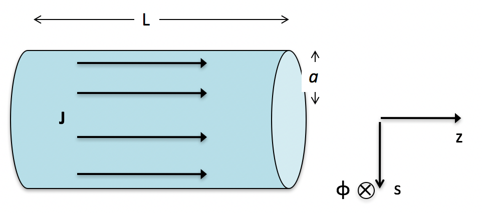

<section data-markdown>

Our global statement of energy conservation is:
$$\dfrac{dU_q}{dt} + \dfrac{dU_e}{dt} = -\iint \mathbf{S}\cdot d\mathbf{A}$$
Which term describes that energy of the electromagnetic field?

1. $\frac{dU_q}{dt}$
2. $\frac{dU_e}{dt}$
3. $-\iint \mathbf{S}\cdot d\mathbf{A}$
4. ???

Note:
* Correct Answer: B
</section>

<section data-markdown>

Our global statement of energy conservation is:
$$\dfrac{dU_q}{dt} + \dfrac{dU_e}{dt} = -\iint \mathbf{S}\cdot d\mathbf{A}$$
What does the integral term (without the minus sign) refer to?

2. Total energy coming in
3. Total energy going out
3. Rate of total energy coming in
4. Rate of total energy going out

Note:
* Correct Answer: D
</section>

<section data-markdown>

Consider a current $I$ flowing through a cylindrical resistor of length $L$ and radius $a$ with voltage $V$ applied. What is the E field inside the resistor?

1. $(V/L) \hat{z}$
2. $(V/L) \hat{\phi}$
3. $(V/L) \hat{s}$
4. $(Vs/L^2) \hat{z}$
5. None of the above

Note:
* Correct Answer: A
</section>

<section data-markdown>
Consider a current $I$ flowing through a cylindrical resistor of length $L$ and radius $a$ with voltage $V$ applied. What is the B field inside the resistor?

1. $(I\mu_0/2\pi s) \hat{\phi}$
2. $(I\mu_0s/2\pi a^2)  \hat{\phi}$
3. $(I\mu_0/2\pi a)  \hat{\phi}$
4. $-(I\mu_0/2\pi a)  \hat{\phi}$
5. None of the above

Note:
* Correct Answer: B

</section>

<section data-markdown>

Consider a current $I$ flowing through a cylindrical resistor of length $L$ and radius $a$ with voltage $V$ applied.
What is the direction of the $\mathbf{S}$ vector on the outer curved surface of the resistor?

1. $\pm \hat{\phi}$
2. $\pm \hat{s}$
3. $\pm \hat{z}$
4. ???

Note:
* Correct Answer: B
</section>
