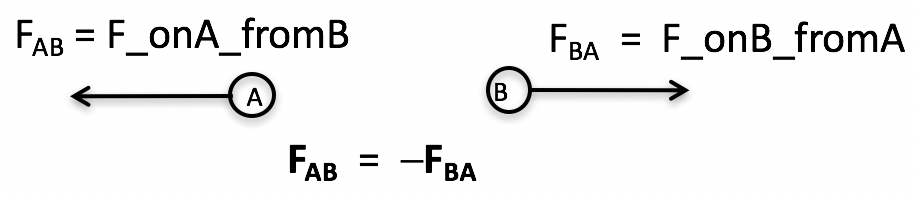

<section data-markdown>

## Announcements

* Quiz Friday after Spring Break (Topic TBD)
* Your papers are due Friday (3/1) by 5pm (20% of your grade BTW)
  * As usual, you will use GitHub to turn them in.
* Homework 7 is due after Spring Break
  * No Help Session this week
* Undergraduate Lunch at noon in 1400 BPS tomorrow

</section>

<section data-markdown>

Newton’s 3rd Law is equivalent to...
1. Conservation of energy
2. Conservation of linear momentum
3. Conservation of angular momentum
4. None of these.  NIII is a separate law of physics.

Note:
* Correct Answer: B

</section>

<section data-markdown>

Consider two point charges, each moving with constant velocity $\mathbf{v}$, charge 1 along the $+x$ axis and charge 2 along the $+y$ axis.
They are equidistant from the origin.

What is the direction of the magnetic force on charge 1 from charge 2? (*You'll need to sketch this! Don’t do it in your head!*)

1. +x
2. +y
3. +z
4. More than one of the above
5. None of the above

Note:
* Correct Answer: B

</section>

<section data-markdown>

Consider two point charges, each moving with constant velocity $\mathbf{v}$, charge 1 along the $+x$ axis and charge 2 along the $+y$ axis.
They are equidistant from the origin.

What is the direction of the magnetic force on charge 2 from charge 1? (You’ll need to sketch this! Don’t do it in your head!)

1. Equal to the answer of the previous question
2. Equal but opposite to the answer of the previous question
3. Something *different* than either of the above.

Note:
* Correct Answer:  C
</section>
