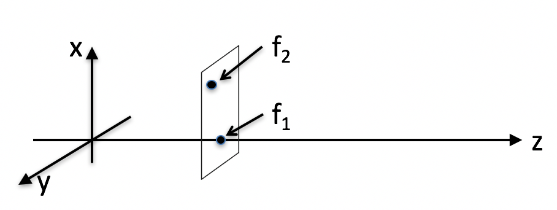

<section data-markdown>

Is "The Wave" at the stadium a transverse wave or a longitudinal wave?
1. Transverse
2. Longitudinal
3. Neither

Note:
* Correct Answer: A

</section>

<section data-markdown>

A wave on a stretched drum head is an example of a:
1. transverse wave
2. longitudinal wave
3. it's not a wave at all

Note:
* Correct Answer: A

</section>

<section data-markdown>

## Announcements

* Papers are graded and grades were sent out
  * Some emails bounced!
* Quiz next Friday (Maxwell Ampere + Poynting Vector)
  * Determine the electric and magnetic field in a situation where there is a displacement current
  * Discuss the direction of the Poynting vector and how it relates to conservation of energy

</section>

<section data-markdown>

The electric field for a plane wave is given by:

$$\mathbf{E}(\mathbf{r},t) = \mathbf{E}_0e^{i(\mathbf{k}\cdot\mathbf{r} - \omega t)}$$

The vector $\mathbf{k}$ tells you:

1. The direction of the electric field vector.
2. The speed of the traveling wave.
3. The direction the plane wave moves.
4. A direction perpendicular to the direction the plane wave moves
5. None of these/MORE than one of these/???

Note:
* Correct Answer: C

</section>

<section data-markdown>

The electric field for a plane wave is given by:

$$\mathbf{E}(\mathbf{r},t) = \mathbf{E}_0e^{i(\mathbf{k}\cdot\mathbf{r} - \omega t)}$$

Suppose $\mathbf{E}_0$ points in the $+x$ direction.
Which direction is this wave moving?

1. The $x$ direction.
2. The radial ($r$) direction
3. A direction perpendicular to both $\mathbf{k}$ and $\mathbf{x}$
4. The $\mathbf{k}$ direction
5. None of these/MORE than one of these

Note:
* Correct Answer: D

</section>

<section data-markdown>

A wave is moving in the $+z$ direction:

$$f(x, y, z, t) = Re\left[A e^{i(kz – \omega t + \delta)}\right]$$

The value of $f$ at the point $(0,0,z_0, t)$ and the point at $(x, y, z_0 , t)$ are related how?

$f_1 = f (0,0,z_0 , t)$  vs.  $f_2  = f(x, y, z_0 , t)$

1. $f_1 = f_2$  always
2. $f_1 >$ or $<$ or $= f_2$  depending on the value of $x,y$

Note:
* Correct Answer: A

</section>

<section data-markdown>

The electric field of an E/M wave is described by:

$$\mathbf{E} = E_0\sin\left(kx-\omega t\right)\hat{\mathbf{y}}$$

What is the direction of the magnetic field?

1. $+x$
2. $+y$
3. $–x$
4. $+z$
5. $-z$

Note:
* Correct Answer: D

</section>
